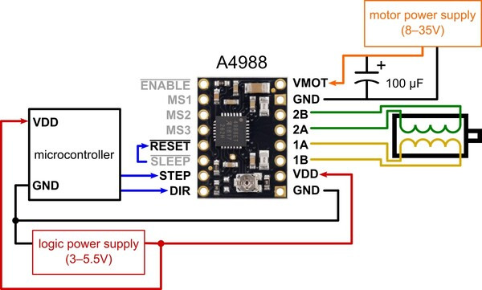

# Bibliothèque Stepper Motors

## Objectif de la bibliothèque

Cette bibliothèque a pour but de simplifier la programmation des moteurs pas-à-pas avec une **STM32**. Elle repose sur le driver **A4988**, un composant qui assure l'interface entre le circuit de commande (basse tension et courant) et le circuit de puissance (haute tension et courant). Ce driver permet de faire tourner un moteur pas-à-pas avec une seule impulsion électrique (un front montant électrique = 1 pas du moteur).

Le montage électrique simple entre le composant et la carte est le suivant :



Des bibliothèques existent déjà pour piloter ce type de moteurs, mais elles ont un inconvénient majeur : pour des raisons de compatibilité, leurs fonctions de rotation du moteur sont bloquantes (il faut attendre la fin de la rotation avant de poursuivre l'exécution du code). Cela rend impossible l'utilisation simultanée de plusieurs moteurs.

Pour résoudre ce problème, nous utilisons les périphériques matériels de la STM32, notamment les timers, qui génèrent un signal PWM en continu (sans intervention logicielle). Une interruption matérielle est déclenchée à chaque front montant du signal PWM. En comptant le nombre de pas effectués à chaque interruption, il est possible d'arrêter les moteurs après le nombre exact de pas requis.

Chaque instance de la classe `Stepper_Motor_t` doit posséder sa propre fonction d'interruption. Pour simplifier, nous appelons ces interruptions des "compteurs". Actuellement, le nombre de compteurs est limité à 4 (de 0 à 3).

## Constructeur

```cpp
StepperMotor_t(uint32_t stepsPerRev, uint32_t dirPin, uint32_t stepPin, uint32_t pwmChannel, HardwareTimer &timer);
```

- `stepsPerRev` : Nombre de pas nécessaires pour effectuer un tour complet. Cette information est disponible dans la documentation technique de chaque moteur.
- `dirPin` : Numéro de la broche définissant la direction de rotation.
- `stepPin` : Numéro de la broche envoyant les fronts montants pour faire tourner le moteur. **Cette broche doit être compatible avec le PWM.**
- `pwmChannel` (OPTIONNEL) : Numéro du canal utilisé par le PWM. S'il n'est pas renseigné, un canal disponible est sélectionné automatiquement.
- `timer` (OPTIONNEL) : Instance du timer utilisée pour générer le signal PWM. Si non renseigné, un timer disponible est sélectionné automatiquement.

## Méthodes de la classe

### `setCounterInstance(uint32_t counter_instance)`
Définit l'instance du compteur ISR associée au moteur pas-à-pas.

### `setSpeed(float rotPerSec)`
Définit la vitesse de rotation du moteur en tours par seconde.

### `setDirection(bool direction)`
Définit la direction du moteur (horaire ou anti-horaire).

### `changeDirection()`
Inverse la direction actuelle du moteur.

### `stop()`
Arrête immédiatement le moteur en mettant en pause le signal PWM.

### `setPositionAndWait(uint32_t nbOfStep, float rotPerSec, uint32_t counter_instance)`
Définit une position cible et attend que le moteur atteigne cette position avant de poursuivre l'exécution du programme.

### `setPosition(uint32_t nbOfStep, float rotPerSec, uint32_t counter_instance)`
Définit une position cible et démarre le moteur sans bloquer l'exécution du programme.

## Exemple d'utilisation

Pour faire osciller le moteur entre deux positions :

```cpp
#include <Arduino.h>
#include "stepper_motor.h"
#include "test_bench.h"

#define NUMBER_OF_STEP_TO_DO 1200
#define MOTOR_SPEED 0.5
#define COUNTER_INSTANCE 1

// Création d'une instance de HardwareTimer
HardwareTimer timer1(TIM1);
StepperMotor_t motor(200, D10, D9, 1, timer1);

void setup()
{
  // Permet de lancer le banc de test pour vérifier les sous-fonctions et tester le matériel
  if (TEST_BENCH_ENABLE == 1)
  {
    test_bench();
  }

  // Initialisation du port série pour le débogage
  Serial.begin(9600);
  delay(5000);
}

void loop()
{
  motor.setPositionAndWait(NUMBER_OF_STEP_TO_DO, MOTOR_SPEED, COUNTER_INSTANCE);
  motor.changeDirection();
  delay(2000);
}
```

